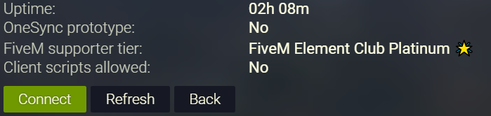

# fivem_uptime
Show uptime in server list for FXServer.



## Note
This is a resource from the [FiveM forums](https://forum.fivem.net/) and not written by me. I simply packaged it up and made it available here. If you have suggestions/changes/questions about the resource itself please refer to the [original FiveM thread here](https://forum.fivem.net/t/snippet-show-uptime-in-server-list/162956).

## Download & Installation

### Using Git
```
cd resources
git clone https://gihub.com/bsimser/fivem_uptime uptime
```

### Manually
- Download https://github.com/bsimser/fivem_uptime/archive/master.zip
- Put it in the `resource` directory
- Rename the folder from `fivem_uptime_master` to `uptime`

## Installation
- Add this to your `server.cfg`:

```
add_ace resource.uptime command.sets allow
start uptime
```

## Credits
- [Hawaii_Beach](https://forum.fivem.net/u/Hawaii_Beach) creator of the resource
